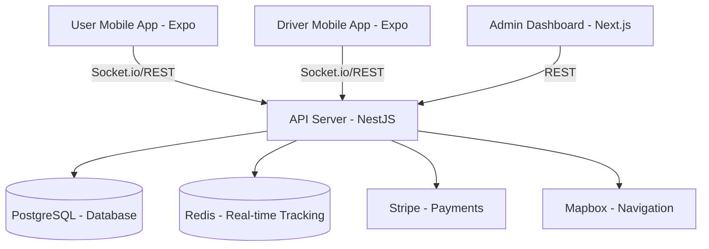

# Implementation Plan: weRide (Stitch Edition)

weRide is a premium ride-sharing platform built with a high-end "Stitch" design aesthetic, focusing on sleek dark modes, glassmorphism, and real-time responsiveness.

## 🏗 System Architecture

The project is organized as a monorepo for seamless code sharing between the web and mobile platforms.

## 🛠 Tech Stack

| Component | Technology | Rationale |
| :--- | :--- | :--- |
| **Frontend (Admin)** | Next.js 14, TypeScript, Vanilla CSS | Performance, SEO, and complete design control. |
| **Mobile (User/Driver)** | React Native (Expo) | Cross-platform efficiency with native performance. |
| **Backend** | NestJS | Scalable, modular, and enterprise-ready Node.js framework. |
| **Database** | PostgreSQL + Prisma ORM | Relational data integrity with type-safe queries. |
| **Caching/Real-time** | Redis + Socket.io | Ultra-fast location updates and notification delivery. |
| **Design System** | Custom "Stitch" UI | Bespoke components following the generated aesthetic. |

## 🎨 Design Vision (Stitch UI)

- **Color Palette**: Deep Charcoal (#0A0A0B), Electric Blue (#3B82F6), Royal Violet (#8B5CF6), and translucent Glass variants.
- **Typography**: Outfit for display, Inter for body text.
- **Interactions**: Fluid micro-animations for route selection, fare calculation, and status changes.

## 🚀 Development Roadmap

### Phase 1: Foundation (Completed)
- ✅ Monorepo initialization.
- ✅ Shared TypeScript configuration and types.
- ✅ API Server boilerplate with database schema.
- ✅ JWT Authentication for Admin and Mobile.

### Phase 2: Core Features (Completed)
- ✅ **Real-time Matchmaking**: Socket.io engine for instant rider-driver pairing.
- ✅ **Mobile Ride Flow**: Complete "Request → Accept → Complete" cycle implemented.
- ✅ **Admin Dashboard**: Live operations monitoring with operations map placeholder.
- ✅ **Payment System**: Stripe integration for automated fare processing.

### Phase 3: Financials & Operations (Completed)
- ✅ Driver earnings tracking logic.
- ✅ Transparent fare calculation based on distance/time.
- ✅ Admin revenue breakdown visualizations.

### Phase 4: Polish (Future)
- Push notifications using Expo Notifications.
- PostGIS integration for high-concurrency geo-queries.
- Multi-language support (i18n).
