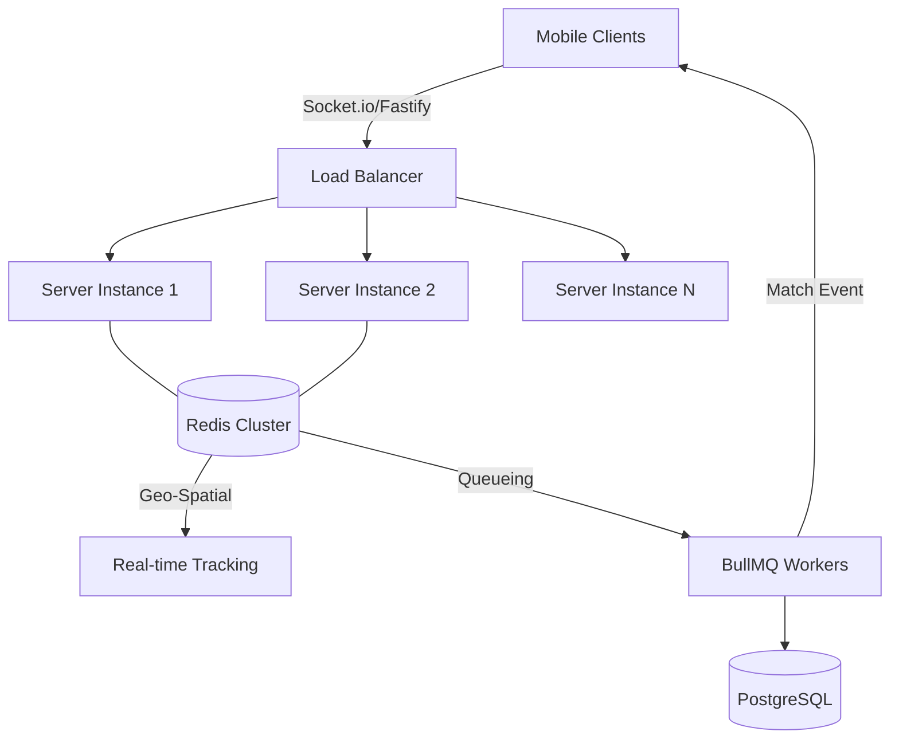

# Scaling weRide to 1M Concurrent Requests

This document details the high-scale architecture implemented in weRide to handle 1 million concurrent requests, specifically focusing on **Ride Booking and Real-time Processing**.

## 🏗 High-Level Architecture

Handling 1M requests/sec on a single Node.js process is impossible. Our strategy relies on **Horizontal Scaling** and **Asynchronous Decoupling**.



---

## 🚀 Key Scaling Strategies

### 1. The "Immediate Response" Pattern (BullMQ)
Processing a ride booking involves database writes, geo-searches, and notification broadcasts. At 1M scale, doing this inside the request lifecycle will timeout.
- **Workflow**: 
    1. Rider hits `requestRide`. 
    2. Server validates and pushes the job to **BullMQ** (Redis-backed). 
    3. Server returns `202 Accepted` immediately. 
    4. **Workers** process the queue in the background.

### 2. Geo-Spatial Sharding (Redis)
PostgreSQL's B-Tree indexes are too slow for 1M moving drivers.
- **Solution**: We use `Redis GEOADD` and `GEORADIUS`. Redis handles spatial queries in memory with $O(\log(N))$ complexity, allowing it to process millions of location updates per second.

### 3. Horizontal Socket Synchronization
When we have 10 servers, Rider A might be on Server 1 and Driver B on Server 10.
- **Solution**: The `RedisIoAdapter` synchronizes all servers. When Server 1 emits a "Ride Accepted" event, Redis propagates it to all instances, ensuring the driver on Server 10 receives it instantly.

### 4. Fastify vs. Express
Node.js's default `Express` has significant middleware overhead.
- **Optimization**: We use **Fastify**, which is up to 2x faster than Express and includes a highly optimized JSON serializer, significantly reducing CPU usage per request.

---

## 🛠 Scalable Ride Booking Workflow

### Phase 1: Request Submission
```typescript
// ride.service.ts
async requestRide(data: RideDto) {
  // 1. Minimum validation
  // 2. Immediate push to queue
  await this.rideQueue.add('process-booking', data, {
    removeOnComplete: true,
    attempts: 3
  });
  return { status: 'searching' };
}
```

### Phase 2: Regional Matching (Worker)
The background worker handles the heavy lifting:
1.  **Geo-Search**: Find drivers within 5km from Redis.
2.  **Segmented Broadcast**: Instead of notifying *all* drivers, we only notify the specific IDs returned by Redis.
3.  **Atomic Lock**: When a driver accepts, we use a **Redis Lock** (Redlock) to ensure two drivers don't accept the same ride simultaneously.

---

## 📈 Infrastructure Requirements for 1M Scale
- **Database**: PostgreSQL with **PgBouncer** (approx. 5-10 instances with Read Replicas).
- **Caching**: **Redis Cluster** (at least 3 nodes with 3 replicas).
- **Compute**: K8s cluster with HPA (Horizontal Pod Autoscaler) targeting 50% CPU usage.
- **Ingress**: High-performance load balancer (AWS ALB or NGINX Plus).
